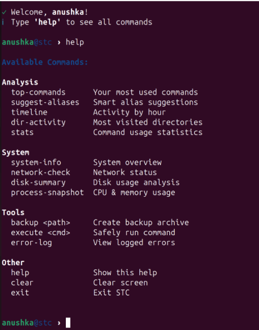
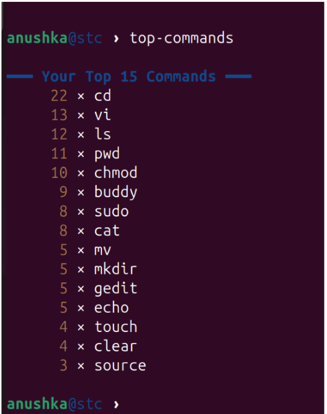
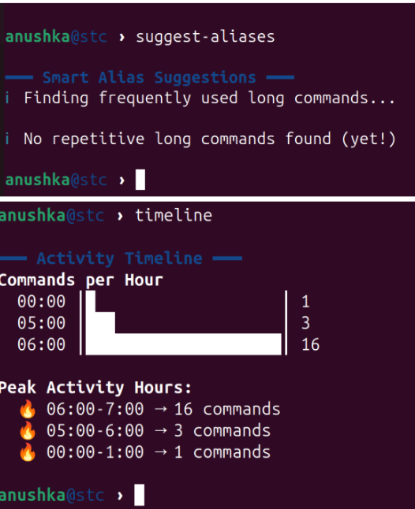

# 🖥️ Smart Terminal Companion (STC)

##  Overview

**Smart Terminal Companion (STC)** is an intelligent Bash-based CLI tool designed to enhance terminal productivity and provide deep insights into command usage and system performance.

It acts as a **personal terminal assistant**, helping developers analyze their workflow, optimize commands, monitor system resources, and automate repetitive tasks efficiently.

---

##  Key Features

###  Command Usage Analysis

* Displays most frequently used commands
* Provides command usage statistics
* Helps improve productivity

###  Smart Alias Suggestions

* Detects repetitive long commands
* Suggests optimized aliases automatically

###  Activity Timeline

* Visualizes command usage patterns
* Identifies peak working hours

###  Directory Tracking

* Tracks most visited directories
* Helps understand workflow patterns

###  System Monitoring

* CPU and memory usage
* Disk usage analysis
* Process monitoring

###  Network Checker

* Internet connectivity status
* Active network connections

###  Productivity Tools

* Safe command execution
* Backup manager
* Error logging system

---

## 🛠️ Tech Stack

* **Bash Scripting**
* Linux utilities (`awk`, `grep`, `ps`, `df`, `uptime`)

---

##  How to Run

###  Make executable

```bash
chmod +x stc.sh
```

###  Run

```bash
./stc.sh
```

---

##  Demo / Screenshots

###  Interactive CLI Interface



###  Top Commands Analysis



###  Command Execution & Features



---

##  Real-World Use Cases

STC helps developers:

* Improve terminal productivity
* Analyze command usage patterns
* Automate repetitive tasks
* Monitor system performance

---

##  Future Enhancements

* AI-based command suggestions
* Voice-enabled CLI
* GUI dashboard
* Cross-platform support

---

##  What Makes This Project Stand Out

* Unique idea (terminal intelligence tool)
* Combines **system monitoring + productivity**
* Demonstrates **advanced Bash scripting skills**
* Real-world developer utility

---

##  Author

**Anwesha Sharma**
